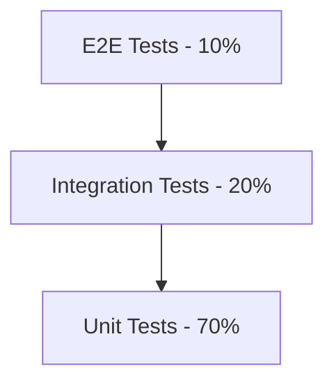

# Unit Testing vs Integration Testing

## Introduction
This guide provides a comprehensive overview of unit testing and integration testing - two fundamental software testing methodologies. Understanding their differences, use cases, and implementation strategies is crucial for building robust, maintainable software systems.

## Unit Testing

### Definition
Unit testing is the process of verifying that individual functions or methods return expected results for various inputs, including standard cases and edge cases.

### Key Characteristics
- **Isolation**: Tests only the logic defined within the specific function
- **Mocking**: External dependencies (network calls, database access, other functions) are mocked
- **Focus**: Answers the question: *"If all external components work correctly, does this unit function as expected?"*
- **Scope**: Tests individual components in isolation
- **Speed**: Executes very quickly (milliseconds per test)

### Best Practices
1. Test all logical branches (if/else, loops)
2. Include edge cases (empty inputs, boundary values)
3. Use descriptive test names (e.g., `test_calculate_tax_with_negative_income`)
4. Keep tests independent (no test should rely on another)
5. Follow Arrange-Act-Assert pattern:
```python
def test_add_numbers():
    # Arrange
    a = 5
    b = 3
    
    # Act
    result = add(a, b)
    
    # Assert
    assert result == 8
```

### When to Mock
Mock these external dependencies:
- Database calls
- Network requests (API calls)
- File system operations
- Other complex functions
- External services

## Integration Testing

### Definition
Integration testing verifies that multiple application components work together correctly by testing code paths end-to-end.

### Key Characteristics
- **Holistic Approach**: Tests interactions between modules/services
- **Minimal Mocking**: Only low-level external dependencies are mocked
- **Focus**: Answers the question: *"Do these components work together as expected?"*
- **Scope**: Tests multiple integrated components
- **Real Connections**: Uses actual databases, networks, and internal APIs

### Best Practices
1. Test critical user workflows
2. Verify data flow between components
3. Test error handling across boundaries
4. Use real dependencies where possible
5. Maintain test environment consistency

### Mocking Strategy
Mock only these external dependencies:
- Third-party APIs
- Payment gateways
- External authentication services
- Email/SMS services
- Cloud storage systems

## Key Differences Summary

| Characteristic         | Unit Testing                  | Integration Testing            |
|------------------------|-------------------------------|--------------------------------|
| **Scope**              | Single function/class         | Multiple components/modules    |
| **External Dependencies** | Heavily mocked              | Only critical externals mocked |
| **Execution Speed**    | Very fast (ms)                | Slower (seconds/minutes)       |
| **Test Focus**         | Internal logic correctness   | Component interactions        |
| **When Executed**      | During development            | Pre-merge/CI pipelines         |
| **Failure Indicates**  | Broken function logic         | Broken component integration  |

## Testing Pyramid Recommendation


## Example Scenario: User Registration

### Unit Test Approach
```python
# Mock database dependency
@patch('user_repository.save_user')
def test_create_user(mock_save):
    # Test validation logic only
    result = create_user("invalid@email")
    assert result == False
    mock_save.assert_not_called()
```

### Integration Test Approach
```python
# Real database connection
def test_user_registration_flow():
    # Test full workflow
    response = api_client.post("/register", {"email": "test@valid.com"})
    assert response.status_code == 201
    assert database.user_exists("test@valid.com")
```

## Conclusion
Both testing methodologies are essential for different reasons:
- **Unit tests** provide rapid feedback during development and ensure core logic correctness
- **Integration tests** verify system cohesion and catch interface issues

A balanced testing strategy typically follows the testing pyramid principle:
- 70% unit tests
- 20% integration tests
- 10% end-to-end tests

By combining both approaches, teams can build maintainable systems with confidence in both component quality and system integration.